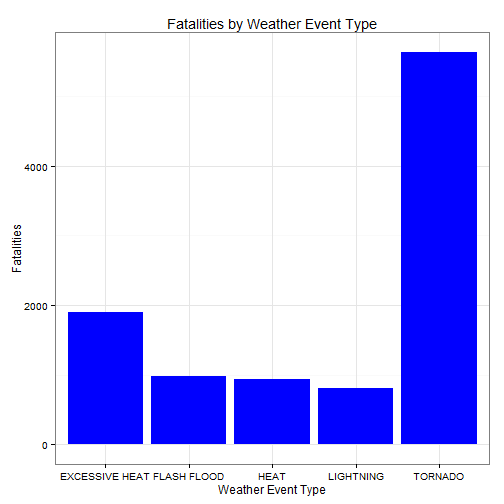
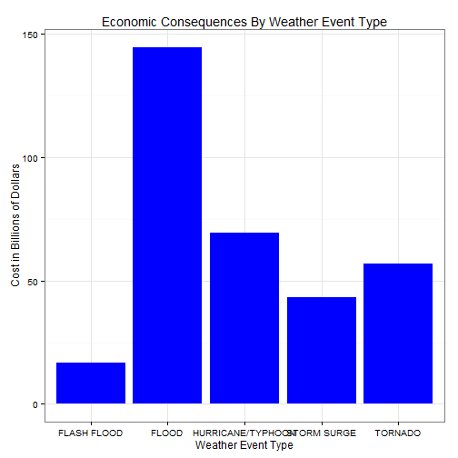

#POPULATION HEALTH AND ECONOMY IMPACT BY WEATHER EVENT TYPE

##SYNOPSIS

Storms and other severe weather events can cause both public health and economic problems for communities and municipalities. Many severe events can result in fatalities, injuries, and property damage, and preventing such outcomes to the extent possible is a key concern.

This project involves exploring the U.S. National Oceanic and Atmospheric Administration's (NOAA) storm database. This database tracks characteristics of major storms and weather events in the United States, including when and where they occur, as well as estimates of any fatalities, injuries, and property damage.

Data covers events from 1950 to 2011.

#### Questions that we need to answer with this data

1.Across the United States, which types of events (as indicated in the EVTYPE variable) are most harmful with respect to population health?

2.Across the United States, which types of events have the greatest economic consequences?

##DATA PROCESSING

Loading original data from NOAA Storm Database.
Loading some libraries.


```r
URL <- "http://d396qusza40orc.cloudfront.net/repdata%2Fdata%2FStormData.csv.bz2"
download.file(URL,"data.csv.bz2")
data <- read.csv("data.csv.bz2")
```

Loading needed Libraries


```r
library(reshape)
library(ggplot2)
library(car)
```

The most important variable is: EVTYPE, which indicates what type of weather event cause the damage, injuries, or fatalities.

#### Analysis for Fatalities

First, we need to analyze what type of weather event is most harmful with respect to population health (first question)
In this case, is the amount of fatalities by the weather event type.


```r
Fatal <- aggregate(FATALITIES ~ EVTYPE, data = data, FUN = sum)
Top5Fatal <- Fatal[order(Fatal$FATALITIES, decreasing = T), ][1:5,]
ggplot(Top5Fatal, aes(EVTYPE, FATALITIES)) + geom_bar(stat = "identity", fill = "Blue") + 
    ylab("Fatalities") + xlab("Weather Event Type") + theme_bw() + 
    ggtitle("Fatalities by Weather Event Type")
```

 

#### Analysis for Economic Impact

Second, we need to analyze what type of weather event have greatest economic consecuence (second question).
For this case, we use Property Damage variables to calculate Costs by Weather Event Type.
Damage will be calculated by:
PROPDMG : Amount of the damage in dollars.
PROPDMGEXP: Multiplier (K: Thousands, M: Millions, B: Billions, H: Hundreds, Number: * 10expN)


```r
data$PROPDMG <- data$PROPDMG * as.numeric(Recode(data$PROPDMGEXP, 
    "'0'=1;'1'=10;'2'=100;'3'=1000;'4'=10000;'5'=100000;'6'=1000000;'7'=10000000;'8'=100000000;'B'=1000000000;'h'=100;'H'=100;'K'=1000;'m'=1000000;'M'=1000000;'-'=0;'?'=0;'+'=0", 
    as.factor.result = FALSE))
Cost <- aggregate(PROPDMG ~ EVTYPE, data, sum)
Top5Cost <- Cost[order(Cost$PROPDMG, decreasing = T), ][1:5,]
Top5Cost$PROPDMG <- Top5Cost$PROPDMG / 1000000000
ggplot(Top5Cost, aes(EVTYPE, PROPDMG)) + geom_bar(stat = "identity", fill = "blue") + 
    ggtitle("Economic Consequences By Weather Event Type") + ylab("Cost in Billions of Dollars") + 
    theme_bw() + xlab("Weather Event Type")
```

 
Top5Cost

##RESULTS

####Question 1

1.Across the United States, which types of events (as indicated in the EVTYPE variable) are most harmful with respect to population health?

Ans: As we saw on the first picture (Fatalities by Weather Event Type), the most harmful weather event type is "Tornado" with 5633 deads for these 62 years.

####Question 2

2.Across the United States, which types of events have the greatest economic consequences?

Ans: On the second picture (Economic Consequences By Weather Event Type), we can see that "Flood" was the weather event type that had greatest economic consequences with 144 Billion of Dollars in looses.

